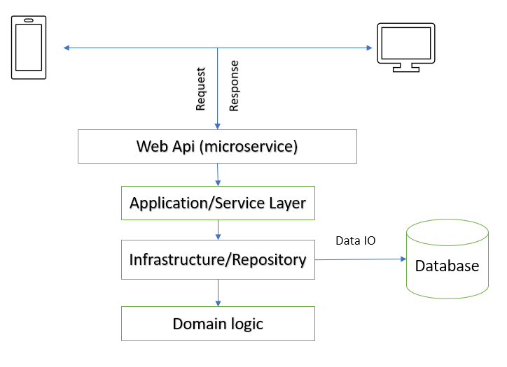

<!-- Improved compatibility of back to top link: See: https://github.com/othneildrew/Best-README-Template/pull/73 -->
<a name="readme-top"></a>


<!-- TABLE OF CONTENTS -->
<details>
  <summary>Table of Contents</summary>
  <ol>
    <li>
      <a href="#about-the-project">About The Project</a>
      <ul>
        <li><a href="#objective">Objective</a></li>
        <li><a href="#project-overview">Project Overview</a></li>
      </ul>
    </li>
    <li>
      <a href="#getting-started">Getting Started</a>
      <ul>
        <li><a href="#system-design">System Design</a></li>
        <li><a href="#transaction-management">Transaction Management</a></li>
        <li><a href="#reporting-system">Reporting System</a></li>
        <li><a href="#data-persistence">Data Persistence</a></li>
        <li><a href="#technologies">Technologies</a></li>
        <li><a href="#prerequisites">Prerequisites</a></li>
        <li><a href="#installation">Installation</a></li>
      </ul>
    </li>
    <li><a href="#usage">Roadmap</a></li>
    <li><a href="#contact">Contact</a></li>
  </ol>
</details>


<!-- ABOUT THE PROJECT -->
## About The Project

### Objective: 
Develop a micro-service for managing and reporting financial transactions with a focus on USD and SAR currency conversion.

### Project Overview
Task is to create a micro-service that handles financial transactions. The system should be capable of:

* Recording transactions.
* Converting transactions between USD and SAR currencies.
* Generating basic transaction reports.
* Persisting transactions for retrieval.

<!-- GETTING STARTED -->
## Getting Started

### System Design



There is a Api for storing and retrieving transactions data. For storing transaction details here considered
* TransactionId
* TransactionDate
* TransactionType
* TransactionStatus
* Currency
* Amount
* IBAN (International bank account number)
* BBAN (Basic/domestic bank account number)


### Transaction Management

Transactions.Api is the WebApi project which exposes the api endpoint to interact with this microservice.

* There is a contoller name TransactionController for transaction management. 

  Path is `\src\Transactions.Api\Controllers`. 

* There is a basic currency conversion logic implement in Transactions.Domain library project. The method is defined in CurrencyKnowledgeBase class.

  Path is `\src\Transactions.Domain\Logics`.

### Reporting System

There is a contoller name ReportController for report data generation. 

Path is `\src\Transactions.Api\Controllers`.

### Data Persistence
For data persistency here used Entity Framework core and followed repository pattern to access data from database. Inside of the Transactions.Infrastructure library project there are the repositories.

Path is `E:\github\DotnetcoreEFSqlite\DotnetcoreEFSqlite\src\Transactions.Infrastructure\Repositories`.


### Technologies

This Restful webapi project is built on C# using asp.net core and Entity framework core.

* Language: C#
* Framework: Asp.net core
* Database: Sqlite
* Testing Framework: NUnit
* Version control: git


### Prerequisites

_vscode_ or _visual studio_ IDE is needed for this project. For vscode, _dotnet sdk_ should be installed which will be used by vscode for building and running this project. 

1. Download and install dotnet sdk (if not installed) from https://dotnet.microsoft.com/en-us/download

2. Download and install vscode (if not installed) from https://code.visualstudio.com/Download

3. Install C# extension in vscode (if not installed)

### Installation

1. Clone the repo
   ```sh
   git clone https://github.com/kmferdous/DotnetcoreEFSqlite.git
   ```
2. Opne folder using vscode or visual studio IDE
   
3. Go to `appsettings.json` file of _Transactions.Api_ project folder and update the database filename.
   ```sh
   "ConnectionStrings": {
      "TransactionDatabase": "Data Source=E:\\sqlitedb\\TransactionStore.db"
    }
   ```
4. Now click Run or open terminal and go to `src\Transactions.Api` directory and run following command
    ```sh
      dotnet run
    ```

## Roadmap
- [x] IoC
- [x] Global Error Handle
- [x] Auto Database migration
- [x] Unit Test (partially done)
- [ ] Add Log
- [ ] Add Fluent validation
- [ ] Enrich response model


<!-- CONTACT -->
## Contact

Name - KM Ferdous

Email - kmferdous.buet@gmail.com

linkedIn - https://www.linkedin.com/in/kmferdous/

Project Link: https://github.com/kmferdous/DotnetcoreEFSqlite
